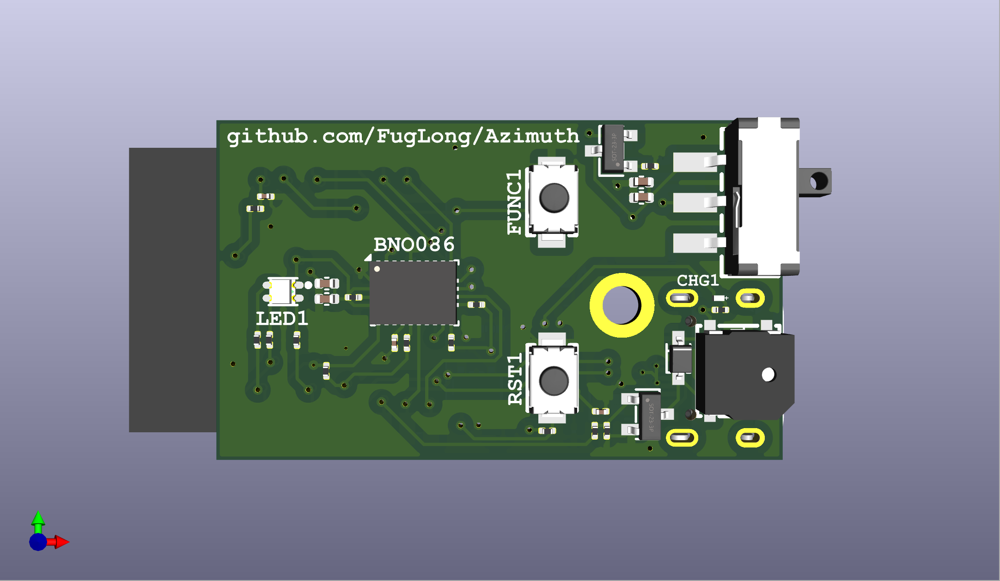
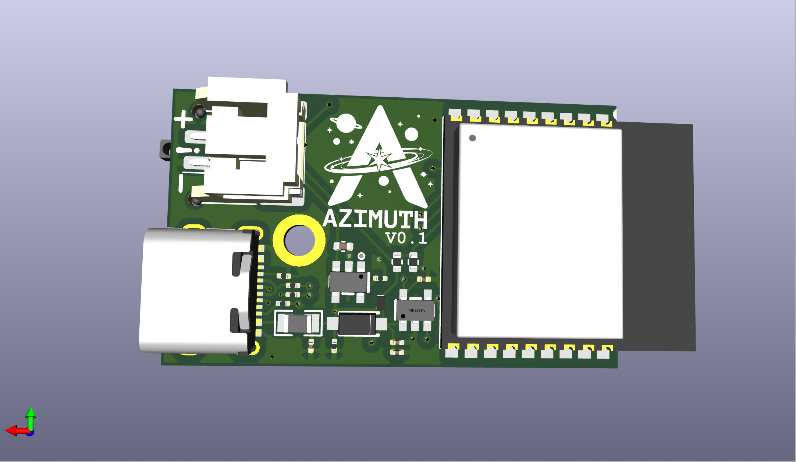

<div align="center">


</div>

# Azimuth

Azimuth is a **DIY head tracker** for flight sims, racing, and anything that works with [OpenTrack](https://github.com/opentrack/opentrack). It pairs a small **ESP32** board with a **BNO08x-class** IMU so you get stable orientation without a closed commercial device. This repo has **firmware**, **PCB** designs, **3D** plans, and **documentation**—build it, change it, or fix it yourself.

### Hardware paths

Two supported builds—same core tracker firmware where both apply; use the row that matches what you assembled.

| Path | What it is | Status |
|------|------------|--------|
| **DIY (XIAO + BNO08x)** | **Seeed XIAO ESP32-C3** + **BNO08x** breakout on **SPI** — breadboard or hand-wired. Default **`azimuth_main_diy`**; selected by default in the [**web flasher**](https://fuglong.github.io/Azimuth/). | **Ready** — tracking, Wi‑Fi, portal, USB Hatire, OpenTrack UDP. |
| **Integrated PCB** | [**`kicad/Azimuth_Design`**](kicad/Azimuth_Design/): **ESP32-C3** module, **BNO086**, RGB, buzzer, button. **`azimuth_main_pcb`**; available in the web flasher hardware selector. | **V0.1** — KiCad **ERC/DRC** clean; **assembled boards in hand**, **bring-up and testing in progress**. Same app as DIY — [roadmap](docs/roadmap.md). |

[**docs/wiring.md**](docs/wiring.md) (pinouts) · [**docs/hardware-profiles.md**](docs/hardware-profiles.md) (PlatformIO / GPIO) · [**docs/parts-list.md**](docs/parts-list.md) (sourcing — DIY store links + PCB BOM)

---

### Get started

| | |
|:---|:---|
| **Install or update firmware (USB)** | [**Azimuth web flasher**](https://fuglong.github.io/Azimuth/) — use **Chrome** or **Edge** and a **data** USB cable. |
| **Update firmware over Wi‑Fi** | Open the portal, hit **Install over Wi‑Fi** in the **Device** card or update banner — *or* hold **FUNC** for ~2 s on the PCB. The chip pulls the latest **official** build from the same GitHub Pages release URL (HTTPS) and reboots into the standby OTA slot. See [**User Guide → Updates**](docs/user-guide.md#9-firmware-updates). |
| **Settings (Wi‑Fi, OpenTrack, device)** | [**http://azimuth.local:8080**](http://azimuth.local:8080) — only after the board is on your home network. First time? Connect to **Azimuth-Tracker** (**Offline Mode**) and follow the [**quick start**](docs/quickstart.md). |
| **Manual (how to use the device)** | [**docs/user-guide.md**](docs/user-guide.md) |
| **Short Wi‑Fi → OpenTrack path** | [**docs/quickstart.md**](docs/quickstart.md) |

---

<div align="center">
<table>
  <tr>
    <td align="center"></td>
    <td align="center"></td>
  </tr>
</table>
</div>

## Overview

- **OpenTrack-first** — Send motion over **Wi‑Fi (UDP)** or **USB (Hatire)**; configure most things in the on-device web UI.
- **Affordable, open stack** — Sensible parts list, KiCad project, and firmware you can build with [PlatformIO](https://platformio.org/).
- **No cloud** — No account or hosted service; setup and tracking stay on your network.
- **Successor** to [Nano33_PC_Head_Tracker](https://github.com/FugLong/Nano33_PC_Head_Tracker): same DIY spirit, but rebuilt around **ESP32** and an external fusion IMU for better results than the old Nano 33 BLE + LSM9DS1 path.

## Need to know

- **Flashing** — Browser install needs **Chrome** or **Edge** (Web Serial). If the installer offers **erase flash**, use it for a clean device (same effect as a full settings reset).
- **First Wi‑Fi setup** — Join **Azimuth-Tracker** (**Offline Mode**), open **`http://192.168.4.1`**, save your home network. Details: [**quick start**](docs/quickstart.md) · full walkthrough: [**User Guide**](docs/user-guide.md).
- **OpenTrack** — Use **either** UDP **or** Hatire as the input, not both at once. Defaults and axis mapping: [**Using Azimuth**](docs/using-azimuth.md#opentrack-on-the-pc).
- **Power, heat, tuning** — Normal for Wi‑Fi on a small module; portal **Tracking & radio** settings; full behavior + battery notes: [**Power, heat, and battery (firmware)**](docs/power-and-thermal.md).

## Documentation

| Doc | Audience |
|-----|----------|
| [**User Guide**](docs/user-guide.md) | **Manual** — Wi‑Fi, portal, FUNC, OpenTrack, updates, battery, troubleshooting |
| [**Quick start**](docs/quickstart.md) | Fast path from flash to tracking over Wi‑Fi |
| [**Using Azimuth**](docs/using-azimuth.md) | Settings portal reference, OpenTrack (USB + Wi‑Fi), tips |
| [**Power, heat, and battery (firmware)**](docs/power-and-thermal.md) | Wi‑Fi power saving, portal polling, defaults; battery runtime / PCB pack polarity |
| [**Development**](docs/development.md) | Building firmware, CI, versioning, repo layout |
| [**Firmware architecture plan**](docs/firmware-architecture-plan.md) | Maintainers — module layout (**network split done**), CI, remaining refactors |
| [**I/O experience plan**](docs/io-led-buzzer-plan.md) | LED / buzzer / FUNC — pause/stasis, layered overrides, **wireless OTA** |
| [**Implementation handoff**](docs/implementation-handoff-prompt.md) | Copy-paste prompt + ordered tasks for agents / new contributors |
| [**Wiring**](docs/wiring.md) · [**Hardware profiles**](docs/hardware-profiles.md) · [**Parts / BOM**](docs/parts-list.md) · [**KiCad**](docs/kicad.md) | Pinouts (DIY + PCB), PlatformIO, BOM, KiCad |
| [**Roadmap**](docs/roadmap.md) | Progress, milestones, future work |

## Goals

- **Performance** — Low latency and stable orientation for games and desktop use.
- **Accessibility** — Easy-to-source parts and open tooling so people can build and modify their own trackers.
- **Interop** — First-class support for the same **OpenTrack** pipelines games and sims already use.
- **Evolvability** — Room for better calibration, on-device UX, and companion apps without legacy platform limits.

## Progress (toward V1)

| Area | Progress | Notes |
|------|:--------:|--------|
| Hardware / BOM | 100% | [Parts list](docs/parts-list.md) |
| Azimuth custom PCB ([`Azimuth_Design`](kicad/Azimuth_Design/)) — **V0.1** | **100%** (layout) · **units received** | Assembled boards **under test**. RGB / buzzer / FUNC in firmware for bring-up — see [wiring](docs/wiring.md) / [parts-list](docs/parts-list.md) — [roadmap](docs/roadmap.md) |
| Firmware | ~90% | Tracking + Wi‑Fi + portal + Hatire + **wireless OTA** + modular **`track_network_*`**; **battery ADC** polish and optional **`main`** layering remain — [roadmap](docs/roadmap.md) |
| 3D enclosure | ~90%+ | **Design nearly complete** — publish / validate next |

```
Hardware/BOM   [████████████████████] 100%
PCB (V0.1)     [████████████████████] 100% design · boards received · testing
Firmware       [██████████████████░░] ~90%
Enclosure      [██████████████████░░] ~90%+ (design)
```

**Detailed roadmap:** [docs/roadmap.md](docs/roadmap.md)
